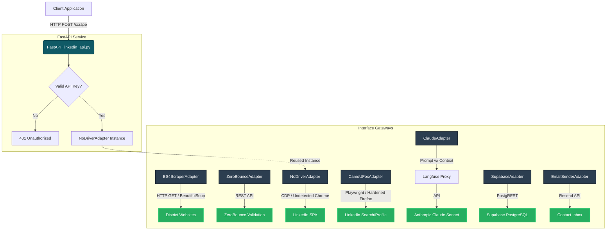

# ProspectKeeper System Architecture & Details

This document provides extremely detailed documentation of the **Adapters** and **FastAPI** implementations powering the ProspectKeeper platform.

## Table of Contents
1. [System Architecture Diagram](#system-architecture-diagram)
2. [FastAPI Implementation Wrapper](#fastapi-implementation-wrapper)
3. [Adapters (Gateways)](#adapters-gateways)
   - [Tier 1: BS4 Scraper Adapter](#tier-1-bs4-scraper-adapter)
   - [Tier 1: ZeroBounce Adapter](#tier-1-zerobounce-adapter)
   - [Tier 2: NoDriver Adapter](#tier-2-nodriver-adapter)
   - [Tier 2: CamoUFox Adapter](#tier-2-camoufox-adapter)
   - [Tier 3: Claude Adapter](#tier-3-claude-adapter)
   - [Data & Comm: Supabase Adapter](#data--comm-supabase-adapter)
   - [Data & Comm: Email Sender Adapter](#data--comm-email-sender-adapter)

---

## System Architecture Diagram

The system employs a multi-tiered architecture based on Clean Architecture principles, leveraging distinct adapters for various external interfaces (headless browsers, LLMs, APIs).

---

## FastAPI Implementation Wrapper

**File:** `linkedin_api.py`

The FastAPI implementation serves as a standalone microservice wrapping the `NoDriverAdapter`. This allows any other service to request a full LinkedIn profile scrape over an HTTP API without importing browser automation dependencies directly.

### Core Architecture
- **Framework**: FastAPI + Uvicorn
- **Concurrency**: Fully asynchronous (`async def`, `await`).
- **Singleton Pattern**: Instantiates a single, persistent underlying `NoDriverAdapter` instance (`_adapter = NoDriverAdapter()`) to maintain one browser session pool across HTTP requests.

### Endpoint Structure

#### `GET /health`
- **Purpose**: A basic liveness probe.
- **Returns**: `{"status": "ok"}`

#### `POST /scrape`
- **Purpose**: Executes a robust, headless LinkedIn scrape.
- **Dependencies**: Secures access via a required `X-API-Key` header matching the `LINKEDIN_API_KEY` environmental variable (defaults to `"dev-key"`).
- **Request Payload (`ScrapeRequest`)**:
  - `linkedin_url` (HttpUrl): Full LinkedIn profile URL.
  - `contact_name` (str): Full name, mostly used for logging/heuristics.
  - `organization` (str): Optional. Used to check if the individual is *still* employed at an organization.
- **Execution Flow**:
  1. Validates the API key.
  2. Calls `_adapter.verify_employment(...)` using the persistent `NoDriverAdapter`.
  3. Formats the raw dictionary outputs into strictly-typed Pydantic schemas (`ExperienceEntry`, `EducationEntry`, `ScrapeResponse`).
- **Response Payload (`ScrapeResponse`)**:
  - Contains rich structured data: Canonical profile URL, full name, headline, location string.
  - Generates an exact wall-clock measure of the execution time (`scrape_duration_seconds`).
  - Contains full histories for experience, education, and skills. Automatically populates from detailed sub-pages if available via the adapter logic.
  - `success` and `blocked` flags dictating if the scrape hit a hard wall, like a LinkedIn auth barrier.

---

## Adapters (Gateways)

The project leverages the **Adapter Pattern** (Clean Architecture Gateways) to interface with external systems. They are structured into "Tiers" of intelligence and cost.

### Tier 1: BS4 Scraper Adapter
**File:** `bs4_scraper_adapter.py`
- **Purpose**: Cost-efficient (`$0.00`), lightning-fast public scraping of standard district websites.
- **Implementation**: Uses `httpx` and `BeautifulSoup`.
- **Flow**:
  1. Receives a district website URL.
  2. Synthesizes a list of likely "staff directory" permutations (`/staff`, `/team`, `/about-us`, etc.).
  3. Issues strict 10s-timeout HTTP GET requests to resolve the staff page.
  4. Parses the DOM to check if the `contact_name` intersects with `organization` context.
  5. Fallback heuristics dynamically map surrounding DOM text directly to `TITLE_KEYWORDS` (e.g., "Director", "Manager").

### Tier 1: ZeroBounce Adapter
**File:** `zerobounce_adapter.py`
- **Purpose**: Hard email validation. Validates SMTP, MX Records, Syntax, and Spam-Traps.
- **Implementation**: REST API call over async `httpx` to ZeroBounce.
- **Cost**: `~$0.004` per credit.
- **Flow**:
  1. Formulates a request explicitly mapping response string literals to discrete `EmailStatus` enums (`VALID`, `INVALID`, `CATCH_ALL`, `SPAMTRAP`).
  2. Synthesizes an upper-level semantic `deliverability` status text ("Deliverable", "Risky", "Undeliverable").

### Tier 2: NoDriver Adapter
**File:** `nodriver_adapter.py`
- **Purpose**: Modern, undetectable headless scraping of complex single-page apps (LinkedIn).
- **Implementation**: Uses `nodriver` (an asynchronous undetectable browser automation framework) and `BeautifulSoup4`.
- **Flow & Resiliency Mechanisms**:
  1. **CDP & State Maint.** Maps environmental variable `LINKEDIN_COOKIES_STRING` or `linkedincookie.json` directly into CDP context natively, preserving authentication.
  2. **Auth-Wall Detection**: Proactively intercepts URLs indicating an auth/challenge redirect and halts securely (`blocked=True`), saving visual evidence (`debug_linkedin_authwall.png`).
  3. **SPA Navigation Extraction**: Loads pages purely via the browser, but defers *all* parsing to `BeautifulSoup` outside of the JS runtime. Prevents "CDP context disconnected" crashes.
  4. **Deep Pagination Retrieval**: Detects `detailLinks` within the main profile DOM, subsequently firing headless tabs explicitly to `/details/education/` and `/details/skills/` to circumvent UI truncation.

### Tier 2: CamoUFox Adapter
**File:** `camoufox_adapter.py`
- **Purpose**: Similar capability pipeline alternative, backed by a drastically hardened Firefox engine proxy mimicking organic human canvas/GPU traces.
- **Implementation**: `AsyncCamoufox` and `Playwright`.
- **Flow**:
  1. Evaluates LinkedIn via standard `page.goto()`.
  2. Submits cookies strictly conforming to Playwright's contextual constraints.
  3. Falls back gracefully to intelligent search `https://www.linkedin.com/search/results/people/?keywords=...` if a direct URL is unavailable.
  4. Executes Regex against DOM `inner_text` explicitly targeting employment titles mapped to the parsed organization context.

### Tier 3: Claude Adapter
**File:** `claude_adapter.py`
- **Purpose**: Advanced, cognitive resolution and deduction for scenarios where static analysis fails or when attempting to calculate "replacement contacts" for individuals who have migrated.
- **Implementation**: Anthropic `claude-sonnet-4-6` mediated by `Langfuse`.
- **Flow**:
  1. **Observability Injection**: Pipes all prompts and metadata through a `Langfuse` proxy explicitly for measuring cost-per-contact and latency.
  2. **System Prompt Engineering**: Forces Claude to adhere to a strict JSON schema leveraging deterministic key-value generation (`contact_still_active`, `replacement_email`, `confidence`, etc.).
  3. **Cost Calculation**: Intercepts `usage.input_tokens` and `usage.output_tokens` directly mapping them back to the USD cost.

### Data & Comm: Supabase Adapter
**File:** `supabase_adapter.py`
- **Purpose**: Implement the domain repository abstract interface (`IDataRepository`) to manage primary persistence.
- **Implementation**: `supabase-py` HTTP PostgREST Client.
- **Flow**:
  1. Maps heavily structured domain entities (`Contact`, `VerificationResult`) seamlessly into raw dictionaries aligning with relational columns in PostgreSQL.
  2. Encapsulates all temporal parsing (translating Supabase ISO 8601 UTC `Z` arrays reliably against Python versions).
  3. Implements specialized retrieval queries (e.g., heavily constrained row filtering for Contacts currently flagged `needs_human_review`).

### Data & Comm: Email Sender Adapter
**File:** `email_sender_adapter.py`
- **Purpose**: External communication interface for out-of-band contact validation directly interfacing natively with the user pipeline.
- **Implementation**: `resend` library for SMTP proxy delivery.
- **Flow**:
  1. Dynamically maps `Contact` schema traits into a preformatted semantic HTML table displaying what ProspectKeeper believes is correct (Title, Linked URL, Organization).
  2. Introduces asynchronous backoff/rate-limits (`asyncio.sleep(0.5)`) prior to API dispatches to stabilize domain reputation.
  3. Relies seamlessly on the Resend API with logging tracking individual email payload IDs for transactional traceability.
