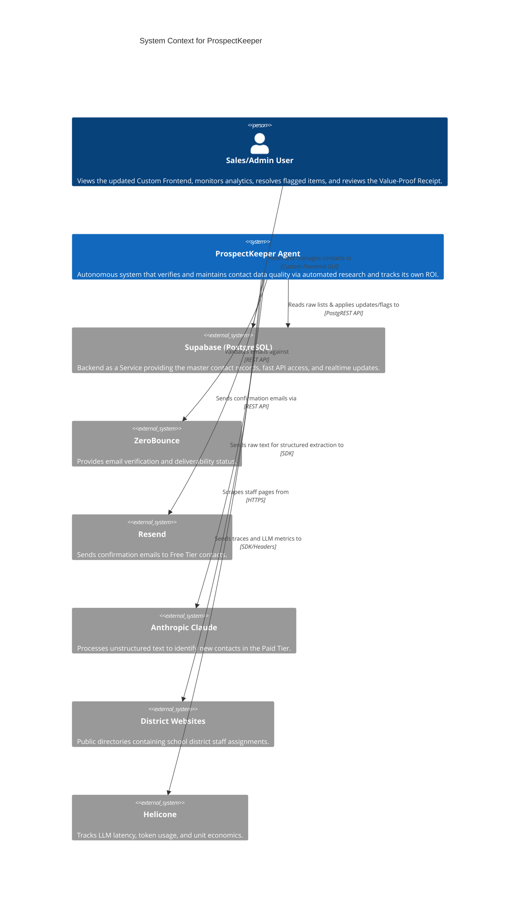
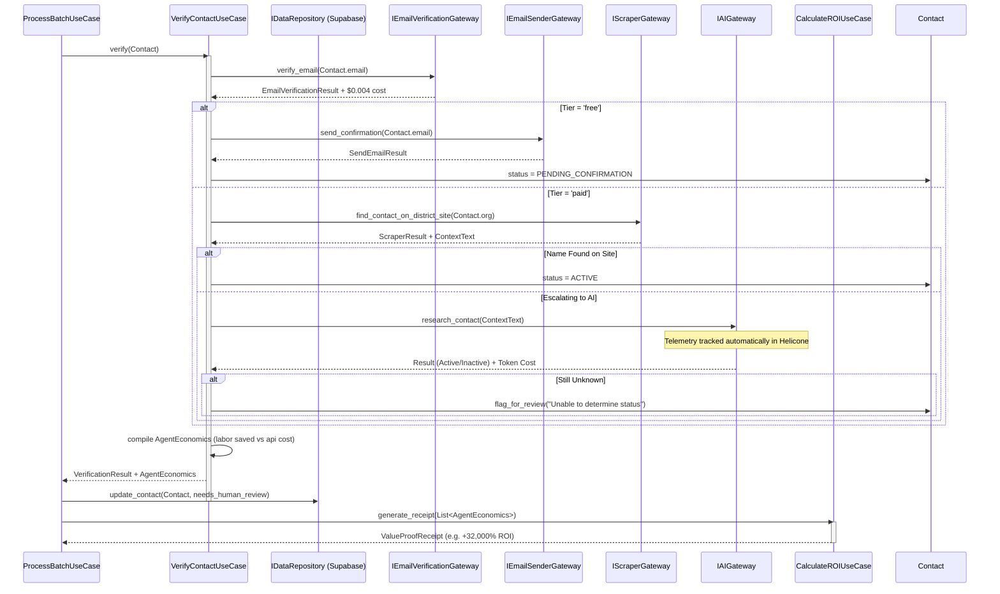

# ProspectKeeper: Product Requirements Document & Technical Architecture

## 1. Executive Summary

**ProspectKeeper** is an autonomous B2B contact list maintenance agent addressing the costly problem of B2B contact list decay (20-30% yearly churn). ProspectKeeper automatically verifies existing contacts, flags uncertain ones for human review, and autonomously researches replacements for departed contacts.

To win the **Paid.ai** track at the HackEurope hackathon, ProspectKeeper completely abandons traditional SaaS flat-fee pricing logic. Instead, it implements a highly transparent **Outcome-Based Pricing Model**, dynamically tracking its own operational API costs against the human labor hours it saves. It generates a live **Value-Proof Receipt (ROI Telemetry)** for every job run, acting as an economically aware digital employee.

## 2. Problem Statement & Business Case

- **The Problem:** B2B contact data decays rapidly as people change jobs, retire, or districts reorganize. Wasted outreach and missed opportunities cost companies $10k-$50k/year in lost SDR efficiency.
- **The Current Solution:** Manual research (hours per week), calling districts, or paying $10k+/year for services like ZoomInfo (which still suffer from decay).
- **The ProspectKeeper Solution:** An autonomous agent that verifies current positions, validates emails, and uses AI to research replacements for departed contacts, all while saving SDR time and tracking exact economic ROI.

## 3. The Paid.ai "Prove Your Value" Features

To win the Paid.ai track, the agent must prove its financial value and demonstrate economic intelligence.

### 3.1 ROI Telemetry & The "Value-Proof" Receipt
Instead of a simple "Job Complete" log, the agent tracks its own API expenditures (ZeroBounce, Claude tokens) and calculates the equivalent human SDR time saved (valued at ~$30/hour). At the end of a run, it produces an ROI dashboard receipt:
> *"Batch Complete: 50 Contacts Verified. 12 Replacements Found. Total API Cost: $0.42. SDR Time Saved: 4.5 hours. Estimated Value Generated: $135. Net ROI for this run: +32,000%."*

### 3.2 Cost-Aware Agentic Routing
The agent utilizes an "Economic Brain" to route contacts between two core tiers:
- **Free Tier:** Checks if the email is structurally valid and deliverable (ZeroBounce) and sends a confirmation email ("Are you still reachable?"). Costs ~$0.004/call.
- **Paid Tier:** Deep, autonomous web research using Anthropic's Claude. It first scrapes the employer's district site, then uses Claude 3.5 Sonnet to determine if the contact is active or departed (and searches for a replacement). Costs ~$0.01 – $0.05/call.

### 3.3 Dynamic Billing Simulation
Demonstrates outcome-based AI billing infrastructure. The custom frontend SQL dashboard generates a simulated invoice based on successful actions (e.g., $0.10 per verification, $2.50 per newly researched replacement), rather than a flat monthly fee.

### 3.4 LLM Observability
The AI layer (Claude API) is wrapped in **Helicone** to provide judges with a transparent, real-time look into latency, token usage, cost-per-contact, and cost-per-replacement.

---

## 4. Technical Architecture: Clean Architecture & DDD

The system is built using **Clean Architecture** (Ports and Adapters) and **Domain-Driven Design (DDD)**. This ensures the complex economic logic is decoupled from external tools (e.g., CamoUFox, ZeroBounce, SQL databases).

### 4.1 System Context Diagram (C4 Level 1)
Shows the overarching landscape of the ProspectKeeper agent in relation to external actors.

### 4.2 Handling Human Review & Uncertainty (Timer vs Confidence)
* **Initial Release:** The validation logic operates on a simple timer (e.g., waiting X seconds for a scraper or API to return).
* **Future Migration:** It will scale towards statistical confidence scores as data stability is established.
* **Flagging:** If the agent exhausts all three tiers of routing, or if the scraped data seems unstable, it immediately flags the record in Supabase for human review to avoid inaccurate data contamination.

### 4.3 Hexagonal Architecture (Ports and Adapters)
Illustrates how the core Domain remains completely decoupled from external frameworks.

```mermaid
%%{init: {'theme': 'base', 'themeVariables': { 'primaryColor': '#E3F2FD', 'edgeLabelBackground':'#ffffff'}}}%%
flowchart TD
    subgraph Infrastructure ["Infrastructure Layer (External Tools & UI)"]
        DB[("Supabase\n(PostgreSQL + Storage)")]
        WEB["District Websites"]
        CL["Claude API"]
        OBS["Helicone"]
        RSND["Resend API"]
        DASH["Custom Frontend Dashboard"]
    end

    subgraph Adapters ["Interface Adapters Layer"]
        SFA["Supabase Adapter"] -.->|"Implements"| IDB
        BSA["BS4 Scraper Adapter"] -.->|"Implements"| ISC
        CLA["Claude Adapter"] -.->|"Implements"| IAI
        RSA["Email Sender Adapter"] -.->|"Implements"| IES
        CLA -.->|"Logs Traces"| OBS
    end

    subgraph Application ["Application Layer (Use Cases)"]
        UC3("ProcessBatchUseCase")
        UC1("VerifyContactUseCase\n(Cost-Aware Routing)")
        UC2("CalculateROIUseCase")
        UC2 -.->|"Renders Receipt"| DASH
    end

    subgraph Domain ["Domain Layer (Core Logic)"]
        IDB[["<Interface> IDataRepository"]]
        IAI[["<Interface> IAIGateway"]]
        ISC[["<Interface> IScraperGateway"]]
        IEV[["<Interface> IEmailVerificationGateway"]]
        IES[["<Interface> IEmailSenderGateway"]]
        
        Contact(["Entity: Contact"])
        Result(["Entity: VerificationResult"])
        Econ(["Entity: AgentEconomics"])
    end

    Infrastructure --> Adapters
    Adapters --> Domain
    Application --> Domain

    UC3 --> UC1
    UC1 --> ISC
    UC1 --> IEV
    UC1 --> IES
    UC1 --> IAI
    UC3 --> UC2
    UC2 --> Econ
```

### 4.4 Domain Model (Class Diagram - Economics Expansion)
Defines the structure of the inner-most circle. The core entities natively understand that their actions are tied to real-world costs and human time.

### 4.5 Sequence Diagram: Cost-Aware Agentic Routing & ROI Telemetry
Shows the interactions as the Use Case executes its rules against the Domain Interfaces, actively minimizing costs. Note the human review flag triggered upon exhausting tiers.

## 5. Technical Specifications & Requirements

### 5.1 CRM Integration (Supabase + Custom Frontend)
Rather than abstracting through a bulky SaaS CRM, the application will use **Supabase** acting as the central data store (utilizing its underlying PostgreSQL and fast REST API layer). This acts as the backend for a custom frontend (built in Streamlit, Gradio, Flutter, or Next.js) to quickly display the target audience, the ROI telemetry dashboard, and any flagged items awaiting human review.

### 5.2 Scraping vs. Timing vs. Confidence
Because accurate confidence scoring requires stable baseline data, the V1 iteration of this logic will enforce strict timeout rules. If scraping or Claude takes too long or returns ambiguous arrays of text instead of an explicit "Match/No Match", the system abandons the attempt and proceeds to the next tier or immediately sets `needs_human_review`. 

### 5.3 Data Privacy (Opt-Out Mechanism)
A basic `opt_out()` method is added to the `Contact` entity to immediately sever tracking and scrub contact details (except for an anonymized hash of the email) to simulate GDPR/CCPA compliance.

### 5.4 Observability via Helicone
All requests dispatched to the Anthropic API via `ClaudeAdapter` will use Helicone's proxy structure. The API key and headers will trace `Cost per Contact` and `Cost per Replacement`.

## 6. Implementation Phases (48 Hours)

- **Phase 1: Domain & Core Architecture (Hours 1-4)**
  - Define `Contact`, `VerificationResult`, `AgentEconomics`, and `ValueProofReceipt`.
  - Stub out all `I*Gateway` interface definitions.
- **Phase 2: Database & Adapters (Hours 5-16)**
  - Set up a new Supabase project and implement `SupabaseDBAdapter` (handling PostgREST calls for data).
  - Implement Tier 1 `BS4ScraperAdapter` and `ZeroBounceAdapter`.
  - Build `EmailSenderAdapter` to send confirmations via Resend.
  - Implement `ClaudeAdapter` directed through Helicone proxy.
- **Phase 3: Core Use Cases (The Economic Brain) (Hours 17-26)**
  - Orchestrate the `VerifyContactUseCase` tiered logic.
  - Implement `CalculateROIUseCase` mapping outputs to raw ROI values.
- **Phase 4: Custom Frontend & Presentation (Hours 27-36)**
  - Build the dashboard showing the contact table.
  - Build a view for `needs_human_review == True` items.
  - Render the **Value-Proof Receipt / Mock Invoice**.
- **Phase 5: Refinement & Demo Preparation (Hours 37-48)**
  - End-to-end testing with a live test batch of contacts.
  - Refine metrics in Helicone to prove the specific economics for the pitch.
