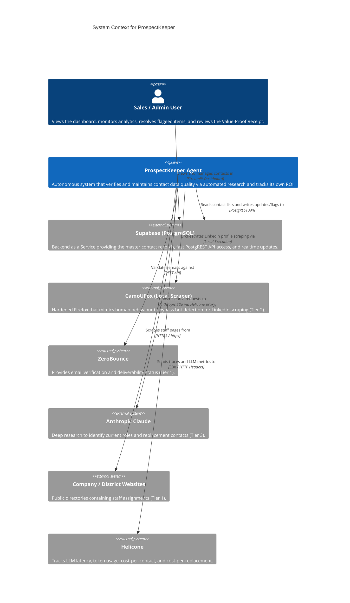
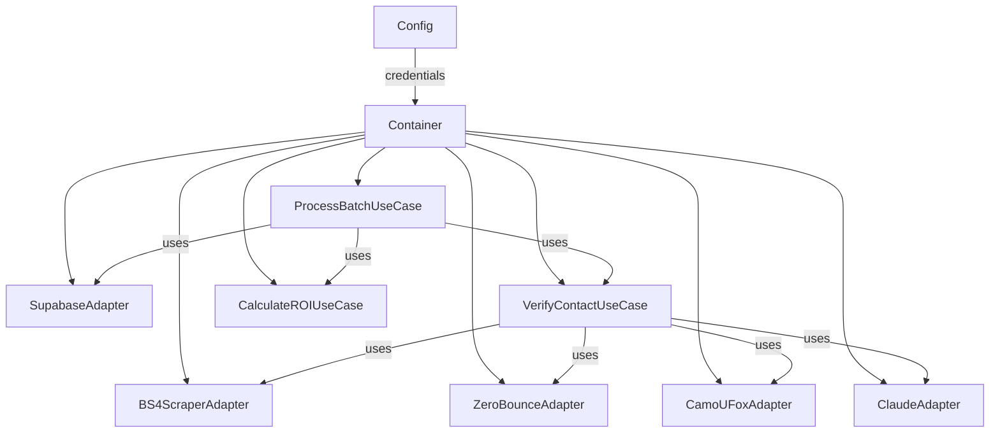
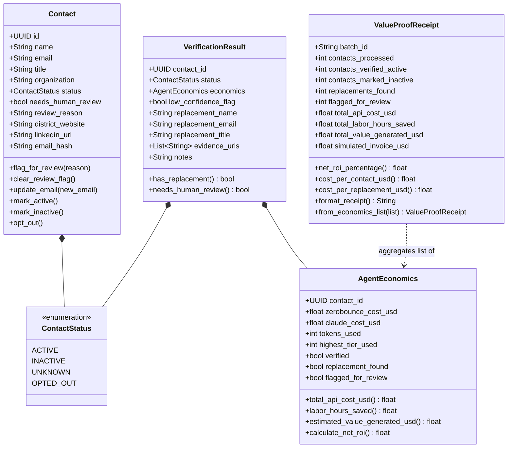
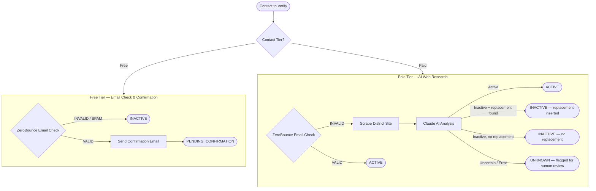

# ProspectKeeper

Autonomous B2B contact list maintenance agent. Verifies whether contacts are still active, flags uncertain ones for human review, and autonomously finds replacements for departed contacts — while tracking its exact economic ROI.

Built for the **Paid.ai** track at HackEurope: every batch run produces a live **Value-Proof Receipt** showing API costs vs. human SDR hours saved, and a simulated outcome-based invoice — proving its own financial value on every run.

---

## Table of Contents

1. [Problem Statement & Business Case](#1-problem-statement--business-case)
2. [The Paid.ai "Prove Your Value" Features](#2-the-paidai-prove-your-value-features)
3. [System Context](#3-system-context)
4. [Architecture Overview](#4-architecture-overview)
5. [Domain Model](#5-domain-model)
6. [Tiered Verification Engine](#6-tiered-verification-engine)
7. [Human Review & Uncertainty](#7-human-review--uncertainty)
8. [Data Privacy & GDPR Opt-Out](#8-data-privacy--gdpr-opt-out)
9. [Module Map](#9-module-map)
10. [Database Schema](#10-database-schema)
11. [API Keys & Environment Setup](#11-api-keys--environment-setup)
12. [Installation](#12-installation)
13. [Running the Agent](#13-running-the-agent)
14. [Test Suite Guide](#14-test-suite-guide)
15. [The Value-Proof Receipt](#15-the-value-proof-receipt)

---

## 1. Problem Statement & Business Case

**The Problem:** B2B contact data decays at 20–30% per year. People change jobs, get promoted, retire, or organisations restructure. Wasted outreach on stale contacts costs companies **$10k–$50k/year** in lost SDR efficiency — time spent dialling dead numbers, emailing departed people, and manually researching who replaced them.

**The Current Solution:** Either manual research (hours per week per SDR), cold-calling switchboards, or paying $10k+/year for services like ZoomInfo — which still suffer from the same decay problem because they refresh data on a slow quarterly cycle, not in real time.

**The ProspectKeeper Solution:** An autonomous agent that verifies current positions, validates emails, finds replacements for departed contacts, and tracks its own exact economic ROI — deployed on demand rather than on a fixed subscription.

---

## 2. The Paid.ai "Prove Your Value" Features

ProspectKeeper is built specifically for the Paid.ai hackathon track, which requires the agent to *prove* its financial value rather than simply completing a task.

### 2.1 ROI Telemetry & Value-Proof Receipt

Instead of a simple "Job Complete" log, the agent tracks its own API expenditures (ZeroBounce credits, Claude tokens) and calculates the equivalent human SDR time saved (valued at ~$30/hour). At the end of every run it produces a receipt:

> *"Batch Complete: 50 Contacts Verified. 12 Replacements Found. Total API Cost: $0.42. SDR Time Saved: 4.5 hours. Estimated Value Generated: $135. Net ROI for this run: +32,000%."*

See [Section 15](#15-the-value-proof-receipt) for a full example and the economic constants that drive the calculation.

### 2.2 Cost-Aware Agentic Routing

The agent uses an "Economic Brain" to minimise its operational costs. It escalates through tiers only when cheaper tiers fail:

- **Tier 1 (Free/Cheap):** Email validation (ZeroBounce) + website scraping (BeautifulSoup)
- **Tier 2 (Free, local compute):** LinkedIn verification via CamoUFox headless browser
- **Tier 3 (Paid):** Deep research via Anthropic Claude

See [Section 6](#6-tiered-verification-engine) for the full routing flowchart.

### 2.3 Dynamic Billing Simulation

The dashboard generates a simulated outcome-based invoice — charged per successful action rather than a flat monthly fee:

- **$0.10** per contact verified
- **$2.50** per replacement contact found

This demonstrates what an outcome-based AI billing model looks like in practice: the customer pays only for value delivered, not for compute time or API calls.

### 2.4 LLM Observability via Helicone

All Claude API calls are routed through **Helicone**, a transparent proxy that gives judges (and customers) a real-time view into:

- Token usage per contact
- Cost-per-contact and cost-per-replacement
- Latency per API call
- Custom metadata tags per request (organisation name, contact name, tier)

This makes the "Prove Your Value" story auditable — every cost claim in the receipt is backed by Helicone trace data.

---

## 3. System Context

The following diagram shows all external actors and systems ProspectKeeper interacts with.



---

## 4. Architecture Overview

ProspectKeeper is built on **Clean Architecture** (Uncle Bob) combined with **Hexagonal Architecture** (Ports & Adapters) and **Domain-Driven Design (DDD)**. The domain layer has zero framework dependencies — all external services are accessed only through injected interfaces.

```
┌─────────────────────────────────────────────────────────────────────┐
│                        FRAMEWORKS & DRIVERS                          │
│   Streamlit UI  │  CLI (main.py)  │  Supabase  │  Claude  │  httpx  │
└────────────────────────────┬────────────────────────────────────────┘
                             │  implements
┌────────────────────────────▼────────────────────────────────────────┐
│                      INTERFACE ADAPTERS                              │
│  SupabaseAdapter  BS4ScraperAdapter  ClaudeAdapter  ZeroBounce ...  │
└────────────────────────────┬────────────────────────────────────────┘
                             │  calls (via interfaces / ports)
┌────────────────────────────▼────────────────────────────────────────┐
│                         USE CASES                                    │
│   VerifyContactUseCase  │  ProcessBatchUseCase  │  CalculateROI     │
└────────────────────────────┬────────────────────────────────────────┘
                             │  operates on
┌────────────────────────────▼────────────────────────────────────────┐
│                           DOMAIN                                     │
│    Contact  │  VerificationResult  │  AgentEconomics  │  Interfaces │
└─────────────────────────────────────────────────────────────────────┘
```

### Hexagonal Architecture (Ports and Adapters)

```mermaid
%%{init: {'theme': 'base'}}%%
flowchart TD
    subgraph Infrastructure ["Infrastructure Layer (External Tools & UI)"]
        DB[("Supabase\n(PostgreSQL + PostgREST)")]
        WEB["Company / District Websites"]
        LI["CamoUFox / Headless Firefox"]
        CL["Claude API"]
        OBS["Helicone"]
        DASH["Streamlit Dashboard"]
    end

    subgraph Adapters ["Interface Adapters Layer"]
        SFA["SupabaseAdapter"] -.->|"Implements"| IDB
        BSA["BS4ScraperAdapter"] -.->|"Implements"| ISC
        LIA["CamoUFoxAdapter"] -.->|"Implements"| ILI
        CLA["ClaudeAdapter"] -.->|"Implements"| IAI
        ZBA["ZeroBounceAdapter"] -.->|"Implements"| IEV
        CLA -.->|"Logs traces"| OBS
    end

    subgraph Application ["Application Layer (Use Cases)"]
        UC3("ProcessBatchUseCase")
        UC1("VerifyContactUseCase\n(Cost-Aware Routing)")
        UC2("CalculateROIUseCase")
        UC2 -.->|"Renders receipt"| DASH
    end

    subgraph Domain ["Domain Layer (Core Logic — zero external deps)"]
        IDB[["IDataRepository"]]
        ILI[["ILinkedInGateway"]]
        IAI[["IAIGateway"]]
        ISC[["IScraperGateway"]]
        IEV[["IEmailVerificationGateway"]]
        Contact(["Entity: Contact"])
        Result(["Entity: VerificationResult"])
        Econ(["Entity: AgentEconomics"])
    end

    Infrastructure --> Adapters
    Adapters --> Domain
    Application --> Domain

    UC3 --> UC1
    UC1 --> ISC
    UC1 --> IEV
    UC1 --> ILI
    UC1 --> IAI
    UC3 --> UC2
    UC2 --> Econ
```



### Dependency Injection

`Container` is the only place that knows about concrete implementations. It wires everything together and can swap any adapter by changing a single line.



### Why Supabase Instead of a SaaS CRM

Rather than abstracting through a bulky SaaS CRM (Salesforce, HubSpot), ProspectKeeper uses **Supabase** as the central data store — giving us a full PostgreSQL database with a fast PostgREST API layer, real-time subscriptions, and Row Level Security, at zero marginal cost. The Streamlit dashboard talks directly to Supabase via the Python client. This keeps the stack minimal and every data operation auditable.

---

## 5. Domain Model

The innermost layer. Every entity natively understands that its actions are tied to real-world costs and human time.



---

## 6. Tiered Verification Engine

The economic brain of the system. Each tier is invoked only if cheaper tiers fail to produce a confident result, keeping per-contact API costs as low as possible.



### Cost Model

| Tier | Services Used | Cost Per Contact | Features |
|------|---------------|-------------------|----------|
| **Free** | ZeroBounce + Resend Email | ~$0.004 | Checks if email exists, sends "Are you still reachable?" confirmation |
| **Paid** | ZeroBounce + BS4 Scraper + Claude 3.5 Sonnet | ~$0.01 – $0.05 | Validates email, scrapes employer website, uses AI to find replacements for departed staff |

---

## 7. Human Review & Uncertainty

### V1: Timer-Based Abandonment

The first release uses strict timeout rules to handle uncertainty. If scraping or Claude takes too long, or returns ambiguous output instead of an explicit match/no-match, the system **abandons the attempt immediately** and moves to the next tier — or sets `needs_human_review = True` if all tiers are exhausted. Speed is prioritised over completeness to prevent the batch from stalling on hard cases.

Contacts land in the human review queue when:
- All three tiers complete without a confident verdict
- Claude returns `contact_still_active: null` (explicitly uncertain)
- A timeout or unexpected exception is caught at any tier

### Future: Confidence Scoring

As stable baseline data accumulates from real batch runs, the timer-based approach will migrate to a **statistical confidence scoring** system. Each tier's output will contribute a weighted confidence score (0.0–1.0). Only when the aggregated score crosses a threshold (e.g. 0.85) will a verdict be committed automatically. Contacts below threshold enter human review rather than being forced to a binary decision.

---

## 8. Data Privacy & GDPR Opt-Out

The `Contact` entity has a built-in `opt_out()` method designed for GDPR/CCPA compliance. When called:

1. The contact's `name`, `email`, `title`, and `linkedin_url` fields are **anonymised** (replaced with placeholder strings).
2. A **SHA-256 hash of the original email** is retained in `email_hash` — this allows the system to recognise future opt-out requests from the same address without storing the PII itself.
3. The contact status is set to `OPTED_OUT`, permanently excluding the record from all future batch verification runs.
4. The `updated_at` timestamp is refreshed.

No data is deleted from the database row — the row is retained for audit and billing reconciliation purposes, but all identifying information is irreversibly removed.

---

## 9. Module Map

```
com-winner/
├── main.py                          # CLI: run / dashboard / import
│
├── prospectkeeper/
│   ├── domain/
│   │   ├── entities/
│   │   │   ├── contact.py           # Contact aggregate root + ContactStatus enum
│   │   │   ├── agent_economics.py   # AgentEconomics + ValueProofReceipt
│   │   │   └── verification_result.py  # VerificationResult value object
│   │   └── interfaces/              # Ports (ABCs) — zero external deps
│   │       ├── i_data_repository.py
│   │       ├── i_scraper_gateway.py
│   │       ├── i_linkedin_gateway.py
│   │       ├── i_ai_gateway.py
│   │       └── i_email_verification_gateway.py
│   │
│   ├── use_cases/
│   │   ├── verify_contact.py        # THE ECONOMIC BRAIN — tiered routing logic
│   │   ├── process_batch.py         # Batch orchestrator (async, semaphore-bounded)
│   │   └── calculate_roi.py         # ValueProofReceipt assembly
│   │
│   ├── adapters/                    # Concrete implementations of the ports
│   │   ├── supabase_adapter.py      # PostgreSQL via Supabase REST client
│   │   ├── bs4_scraper_adapter.py   # httpx + BeautifulSoup website scraper
│   │   ├── zerobounce_adapter.py    # ZeroBounce email verification API
│   │   ├── camofox_adapter.py       # LinkedIn via CamoUFox (optional dep)
│   │   └── claude_adapter.py        # Claude AI via Helicone proxy
│   │
│   ├── infrastructure/
│   │   ├── config.py                # Config frozen dataclass (reads from env)
│   │   └── container.py             # DI container — wires the full object graph
│   │
│   └── frontend/
│       └── app.py                   # Streamlit dashboard (4 pages)
│
├── supabase/
│   └── migrations/
│       ├── 001_initial_schema.sql   # Tables: contacts, verification_results, batch_receipts
│       └── 002_seed_data.sql        # 5 sample B2B contacts
│
├── tests/
│   ├── conftest.py                  # Shared fixtures and mock factories
│   ├── unit/
│   │   ├── domain/                  # Pure entity and value-object tests
│   │   └── use_cases/               # Use case tests with mocked gateways
│   ├── integration/
│   │   └── adapters/                # Adapter tests with mocked HTTP / SDK clients
│   └── test_infrastructure/         # Config and Container wiring tests
│
├── .env.example                     # Template — copy to .env
├── pytest.ini                       # Test runner config (asyncio_mode = auto, cov >= 80%)
├── .coveragerc                      # Coverage exclusions (frontend, camofox)
└── requirements.txt
```

---

## 10. Database Schema

Three tables in Supabase/PostgreSQL. Apply migrations via the Supabase dashboard SQL editor or CLI.

```
contacts
├── id                UUID  PK
├── name              TEXT  NOT NULL
├── email             TEXT
├── title             TEXT
├── organization      TEXT  NOT NULL
├── status            TEXT  CHECK (active|inactive|unknown|opted_out)
├── needs_human_review  BOOLEAN
├── review_reason     TEXT
├── district_website  TEXT          -- used by BS4 scraper (Tier 1b)
├── linkedin_url      TEXT          -- used by CamoUFox (Tier 2)
├── email_hash        TEXT          -- SHA-256, retained after GDPR opt-out
├── created_at        TIMESTAMPTZ
└── updated_at        TIMESTAMPTZ   -- auto-updated by trigger

verification_results              (audit log — one row per verification run)
├── id                UUID  PK
├── contact_id        UUID  FK → contacts.id  ON DELETE CASCADE
├── status            TEXT
├── low_confidence_flag  BOOLEAN
├── replacement_name  TEXT
├── replacement_email TEXT
├── replacement_title TEXT
├── evidence_urls     TEXT[]
├── notes             TEXT
├── api_cost_usd      NUMERIC
├── tokens_used       INTEGER
├── labor_hours_saved NUMERIC
├── value_generated_usd  NUMERIC
├── highest_tier_used SMALLINT      -- 1, 2, or 3
└── verified_at       TIMESTAMPTZ

batch_receipts                    (one row per batch run — the ROI receipt)
├── id                UUID  PK
├── batch_id          TEXT  UNIQUE
├── contacts_processed  INTEGER
├── contacts_verified_active  INTEGER
├── contacts_marked_inactive  INTEGER
├── replacements_found  INTEGER
├── flagged_for_review  INTEGER
├── total_api_cost_usd  NUMERIC
├── total_tokens_used   INTEGER
├── total_labor_hours_saved  NUMERIC
├── total_value_generated_usd  NUMERIC
├── simulated_invoice_usd  NUMERIC  -- outcome-based billing simulation
├── net_roi_percentage  NUMERIC
└── run_at            TIMESTAMPTZ
```

> **Apply schema**: open your Supabase project → SQL Editor → paste and run `supabase/migrations/001_initial_schema.sql`, then `002_seed_data.sql`.

---

## 11. API Keys & Environment Setup

Copy `.env.example` to `.env` and fill in each key:

```bash
cp .env.example .env
```

### Required Keys (the agent will not start without these)

| Variable | Where to get it | Notes |
|----------|----------------|-------|
| `SUPABASE_URL` | Supabase Dashboard → Project Settings → API → Project URL | `https://xxxx.supabase.co` |
| `SUPABASE_SERVICE_KEY` | Supabase Dashboard → Project Settings → API → `service_role` key | Use **service role**, not anon — it bypasses RLS for backend writes |
| `ANTHROPIC_API_KEY` | console.anthropic.com → API Keys | Starts with `sk-ant-` |
| `HELICONE_API_KEY` | helicone.ai → Settings → API Keys | Starts with `sk-helicone-` — required for LLM observability and cost tracking |

### Optional Keys

| Variable | Where to get it | Effect if absent |
|----------|----------------|-----------------|
| `ZEROBOUNCE_API_KEY` | zerobounce.net → API | Tier 1a skipped; all emails treated as UNKNOWN and passed to the scraper |

### Agent Tuning

| Variable | Default | Notes |
|----------|---------|-------|
| `BATCH_LIMIT` | `50` | Max contacts processed per batch run |
| `BATCH_CONCURRENCY` | `5` | Parallel verification workers (asyncio semaphore) |

### Why Helicone Is Required

All Claude API calls are routed through `https://anthropic.helicone.ai/v1` with your Helicone key in the request headers. Helicone captures token counts, costs, latency, and custom metadata (organisation name, contact name, tier) — this data is what makes the Value-Proof Receipt auditable. If you want to remove the Helicone dependency, update `claude_adapter.py` to use the standard Anthropic base URL and downgrade `HELICONE_API_KEY` to optional, but you lose the observability dashboard.

---

## 12. Installation

```bash
# 1. Clone and enter the project
git clone <repo-url>
cd com-winner

# 2. Create and activate a virtual environment
python3 -m venv .venv
source .venv/bin/activate       # Windows: .venv\Scripts\activate

# 3. Install dependencies
pip install -r requirements.txt

# 4. Copy and fill in environment variables
cp .env.example .env
# edit .env with your keys (see section 11 above)

# 5. Apply database migrations
# Open Supabase Dashboard → SQL Editor and run:
#   supabase/migrations/001_initial_schema.sql
#   supabase/migrations/002_seed_data.sql
```

### Optional: LinkedIn Tier (CamoUFox)

Tier 2 (LinkedIn scraping) requires two additional installs. Commented out in `requirements.txt` intentionally — install only if you need LinkedIn verification:

```bash
pip install camoufox[geoip]
playwright install firefox
```

---

## 13. Running the Agent

### Batch verification run

```bash
python main.py run --limit 50 --concurrency 5
```

Processes up to 50 contacts from Supabase, routes each through the tiered engine, writes results back, and prints the Value-Proof Receipt.

### Import contacts from CSV

```bash
python main.py import contacts.csv
```

CSV columns: `name`, `email`, `title`, `organization`, `website` (or `district_website`), `linkedin_url`.

### Streamlit dashboard

```bash
python main.py dashboard
# or directly:
streamlit run prospectkeeper/frontend/app.py
```

Four pages:

- **All Contacts** — full contact table with status badges
- **Human Review Queue** — contacts flagged for manual attention
- **Run Agent** — trigger a batch run from the UI
- **Value-Proof Receipt** — ROI hero metric, economics table, simulated invoice

---

## 14. Test Suite Guide

363 tests, 99.66% coverage. Zero external network calls — all adapters are mocked.

```bash
# Run the full suite
pytest

# Run a specific layer
pytest tests/unit/
pytest tests/integration/
pytest tests/test_infrastructure/

# Run without coverage (faster during development)
pytest --no-cov

# Run a single file
pytest tests/unit/use_cases/test_verify_contact.py -v
```

### What Each Test File Covers

```
tests/
├── conftest.py
│   Shared fixtures: make_contact(), AsyncMock gateways,
│   sample contacts with/without district_website
│
├── unit/domain/
│   ├── test_contact.py (45 tests)
│   │   Contact.create(), flag_for_review(), update_email(),
│   │   mark_active(), mark_inactive(), opt_out() GDPR anonymisation,
│   │   ContactStatus transitions, immutability checks
│   │
│   ├── test_agent_economics.py (46 tests)
│   │   AgentEconomics: total cost, labor hours saved, ROI formula
│   │   ValueProofReceipt: aggregation, net_roi_percentage,
│   │   cost_per_contact_usd, format_receipt() string output
│   │
│   └── test_verification_result.py (12 tests)
│       has_replacement (requires name AND email),
│       needs_human_review (low_confidence OR status==UNKNOWN)
│
├── unit/use_cases/
│   ├── test_verify_contact.py (~60 tests)
│   │   All Tier 1a→1b→2→3 routing paths and short-circuit conditions,
│   │   invalid email statuses that do/don't escalate to next tier,
│   │   context_text passed through to Claude, human-review fallback
│   │
│   ├── test_calculate_roi.py (10 tests)
│   │   auto batch_id generation, receipt aggregation from list
│   │
│   └── test_process_batch.py (~30 tests)
│       contact loading, semaphore-bounded concurrency, status transitions,
│       review flagging, repo persistence calls, replacement insertion,
│       per-contact error isolation, receipt generation
│
├── integration/adapters/
│   ├── test_bs4_scraper_adapter.py (18 tests)
│   │   httpx.AsyncClient mocked via patch_async_client() helper,
│   │   staff URL discovery (404/200 side_effect sequences),
│   │   timeout on page fetch, generic exceptions,
│   │   _parse_staff_page: title keyword extraction, case-insensitive matching
│   │
│   ├── test_zerobounce_adapter.py (28 tests)
│   │   Full EmailStatus mapping parametrised (VALID/INVALID/CATCH_ALL/...),
│   │   empty email short-circuit, empty API key short-circuit,
│   │   timeout, HTTP error, _map_status direct unit tests
│   │
│   ├── test_claude_adapter.py (26 tests)
│   │   _build_prompt contents (name/title/org/context inclusion),
│   │   _parse_response (valid JSON, JSON embedded in prose,
│   │   malformed JSON, missing optional fields, tokens/cost preserved on failure),
│   │   research_contact: model name, max_tokens, token tracking,
│   │   cost formula (input*3.0 + output*15.0)/1e6, Helicone headers,
│   │   API exception → failure result with zero tokens
│   │
│   └── test_supabase_adapter.py (30+ tests)
│       _row_to_contact and _contact_to_row pure unit tests,
│       all async CRUD methods using chained_execute() mock helper:
│       get_all_contacts, get_contacts_for_verification,
│       get_contacts_needing_review, save_contact, insert_contact, bulk_update
│
└── test_infrastructure/
    ├── test_config.py (16 tests)
    │   All 4 required vars, optional vars default/override,
    │   frozen dataclass immutability, EnvironmentError naming missing vars,
    │   multi-missing listing, .env hint in error message
    │
    └── test_container.py (12 tests)
        All 8 adapter/use-case attributes present,
        object identity checks (same repository instance shared across use cases)
```

### Test Markers

```bash
pytest -m unit          # Pure unit tests — no I/O at all
pytest -m integration   # Adapter tests with mocked HTTP/SDK
pytest -m e2e           # Live credentials required (excluded by default)
```

### What Is NOT Unit Tested (and Why)

| File | Reason |
|------|--------|
| `frontend/app.py` | Streamlit requires a running server; excluded via `.coveragerc` |
| `adapters/camofox_adapter.py` | CamoUFox is an optional dependency not installed in CI; excluded via `.coveragerc` |

---

## 15. The Value-Proof Receipt

At the end of every batch run, ProspectKeeper prints (and stores in Supabase) a receipt like this:

```
======================================================================
VALUE-PROOF RECEIPT
======================================================================
Batch: 3f2a1b4c-...
Contacts Processed :  50
Active (Verified)  :  31
Inactive (Departed):  12
Replacements Found :   9
Flagged for Review :   7

--- Costs ---
Total API Cost     : $0.34
  ZeroBounce       : $0.20
  Claude (tokens)  : $0.14  (42,100 tokens)

--- Value Generated ---
Labor Hours Saved  :  4.17 hrs  (5 min/contact x 50 contacts @ $30/hr)
Replacement Value  : $22.50     ($2.50/replacement x 9 found)
Total Value        : $147.00

--- ROI ---
Net ROI            : 432%   (value - cost / cost)

--- Simulated Invoice ---
Verifications      : 50 x $0.10  = $5.00
Replacements Found :  9 x $2.50  = $22.50
TOTAL DUE          :              $27.50
======================================================================
```

**ROI constants** (defined in `agent_economics.py`):

| Constant | Value | Meaning |
|----------|-------|---------|
| `HUMAN_HOURLY_RATE_USD` | $30.00 | SDR labour cost per hour |
| `MINUTES_PER_CONTACT_VERIFICATION` | 5 min | Time a human takes to manually check one contact |
| `MINUTES_PER_REPLACEMENT_RESEARCH` | 15 min | Additional time to research a replacement |
| `BILLED_RATE_PER_VERIFICATION_USD` | $0.10 | Outcome-based charge per verification |
| `BILLED_RATE_PER_REPLACEMENT_USD` | $2.50 | Outcome-based charge per replacement found |
