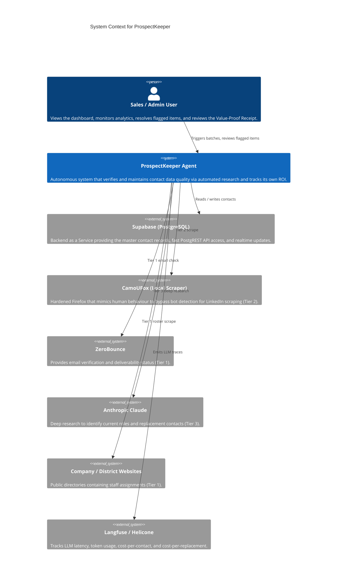
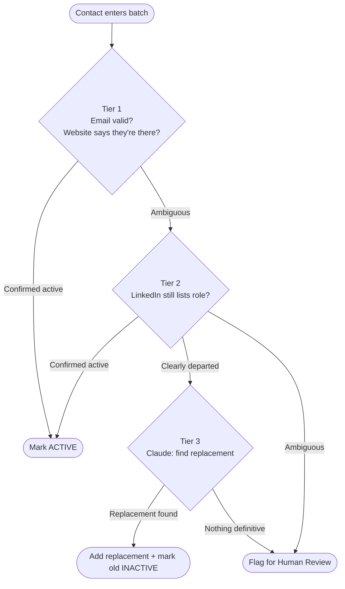

# ProspectKeeper

Autonomous B2B contact list maintenance agent. Verifies whether contacts are still active, flags uncertain ones for human review, and autonomously finds replacements for departed contacts — while tracking its exact economic ROI.

Built for the **Paid.ai** track at HackEurope: every batch run produces a live **Value-Proof Receipt** showing API costs vs. human SDR hours saved, and a simulated outcome-based invoice — proving its own financial value on every run.

---

## UI Showcase

### Manage Contacts — the agentic contact database

The main roster view. Every contact carries a live `STATUS` (active, review, pending_confirmation, unknown) and a `FRESHNESS` stamp driven by the last LinkedIn scrape. Bulk-email and refresh actions kick off agentic workflows in the background.


### Human Review — the agentic escalation queue

When the verification engine can't reach a high-confidence verdict on its own — ambiguous LinkedIn match, missing profile, conflicting signals — the contact is escalated here. Humans see a compact diagnostic from the agent and a one-click **Verify & Update** / **Deactivate** resolution.


### AI Verification Agent — per-contact deep-dive

Open any contact and launch a single-shot agentic verification. Claude autonomously chooses tools (web scrape, LinkedIn, email validation) and iterates until it reaches a verdict — all tool calls are streamed into the dialog in real time.


---

## Table of Contents

1. [Problem Statement & Business Case](#1-problem-statement--business-case)
2. [The Paid.ai "Prove Your Value" Features](#2-the-paidai-prove-your-value-features)
3. [System Context](#3-system-context)
4. [Architecture Overview](#4-architecture-overview)
5. [Domain Model](#5-domain-model)
6. [Tiered Verification Engine](#6-tiered-verification-engine)
7. [Human Review & Uncertainty](#7-human-review--uncertainty)
8. [Data Privacy & GDPR Opt-Out](#8-data-privacy--gdpr-opt-out)
9. [Module Map](#9-module-map)
10. [Database Schema](#10-database-schema)
11. [API Keys & Environment Setup](#11-api-keys--environment-setup)
12. [Installation](#12-installation)
13. [Running the Agent](#13-running-the-agent)
14. [Test Suite Guide](#14-test-suite-guide)
15. [The Value-Proof Receipt](#15-the-value-proof-receipt)

---

## 1. Problem Statement & Business Case

**The Problem:** B2B contact data decays at 20–30% per year. People change jobs, get promoted, retire, or organisations restructure. Wasted outreach on stale contacts costs companies **$10k–$50k/year** in lost SDR efficiency — time spent dialling dead numbers, emailing departed people, and manually researching who replaced them.

**The Current Solution:** Either manual research (hours per week per SDR), cold-calling switchboards, or paying $10k+/year for services like ZoomInfo — which still suffer from the same decay problem because they refresh data on a slow quarterly cycle, not in real time.

**The ProspectKeeper Solution:** An autonomous agent that verifies current positions, validates emails, finds replacements for departed contacts, and tracks its own exact economic ROI — deployed on demand rather than on a fixed subscription.

---

## 2. The Paid.ai "Prove Your Value" Features

ProspectKeeper is built specifically for the Paid.ai hackathon track, which requires the agent to *prove* its financial value rather than simply completing a task.

### 2.1 ROI Telemetry & Value-Proof Receipt

Instead of a simple "Job Complete" log, the agent tracks its own API expenditures (ZeroBounce credits, Claude tokens) and calculates the equivalent human SDR time saved (valued at ~$30/hour). At the end of every run it produces a receipt:

> *"Batch Complete: 50 Contacts Verified. 12 Replacements Found. Total API Cost: $0.42. SDR Time Saved: 4.5 hours. Estimated Value Generated: $135. Net ROI for this run: +32,000%."*

See [Section 15](#15-the-value-proof-receipt) for a full example and the economic constants that drive the calculation.

### 2.2 Cost-Aware Agentic Routing

The agent uses an "Economic Brain" to minimise its operational costs. It escalates through tiers only when cheaper tiers fail:

- **Tier 1 (Free/Cheap):** Email validation (ZeroBounce) + website scraping (BeautifulSoup)
- **Tier 2 (Free, local compute):** LinkedIn verification via CamoUFox headless browser
- **Tier 3 (Paid):** Deep research via Anthropic Claude

See [Section 6](#6-tiered-verification-engine) for the full routing flowchart.

### 2.3 Dynamic Billing Simulation

The dashboard generates a simulated outcome-based invoice — charged per successful action rather than a flat monthly fee:

- **$0.10** per contact verified
- **$2.50** per replacement contact found

This demonstrates what an outcome-based AI billing model looks like in practice: the customer pays only for value delivered, not for compute time or API calls.

### 2.4 LLM Observability via Helicone / Langfuse

All Claude API calls are routed through an LLM-observability proxy, giving judges (and customers) a real-time view into:

- Token usage per contact
- Cost-per-contact and cost-per-replacement
- Latency per API call
- Custom metadata tags per request (organisation name, contact name, tier)

This makes the "Prove Your Value" story auditable — every cost claim in the receipt is backed by trace data.

---

## 3. System Context


```mermaid
C4Context
    title System Context for ProspectKeeper

    Person(admin, "Sales / Admin User", "Views the dashboard, monitors analytics, resolves flagged items, and reviews the Value-Proof Receipt.")

    System(prospectKeeper, "ProspectKeeper Agent", "Autonomous system that verifies and maintains contact data quality via automated research and tracks its own ROI.")

    System_Ext(db, "Supabase (PostgreSQL)", "Backend as a Service providing the master contact records, fast PostgREST API access, and realtime updates.")
    System_Ext(linkedin_scraper, "CamoUFox (Local Scraper)", "Hardened Firefox that mimics human behaviour to bypass bot detection for LinkedIn scraping (Tier 2).")
    System_Ext(zerobounce, "ZeroBounce", "Provides email verification and deliverability status (Tier 1).")
    System_Ext(claude, "Anthropic Claude", "Deep research to identify current roles and replacement contacts (Tier 3).")
    System_Ext(website, "Company / District Websites", "Public directories containing staff assignments (Tier 1).")
    System_Ext(observability, "Langfuse / Helicone", "Tracks LLM latency, token usage, cost-per-contact, and cost-per-replacement.")

    Rel(admin, prospectKeeper, "Triggers batches, reviews flagged items")
    Rel(prospectKeeper, db, "Reads / writes contacts")
    Rel(prospectKeeper, linkedin_scraper, "Tier 2 scrape")
    Rel(prospectKeeper, zerobounce, "Tier 1 email check")
    Rel(prospectKeeper, claude, "Tier 3 deep research")
    Rel(prospectKeeper, website, "Tier 1 roster scrape")
    Rel(prospectKeeper, observability, "Emits LLM traces")
```

---

## 4. Architecture Overview

```mermaid
flowchart LR
    subgraph UI[React Dashboard]
        A[All Contacts]
        B[Human Review]
        C[Value Receipt]
        D[Dashboard + Live Batch]
    end

    subgraph API[FastAPI backend]
        E[/contacts/]
        F[/contacts/review/]
        G[/agent/verify/{id}/]
        H[/batch/run — SSE/]
        I[/batch-receipts/]
        J[/langfuse-stats/]
    end

    subgraph Engine[Verification Engine]
        T1[Tier 1: ZeroBounce + Website]
        T2[Tier 2: CamoUFox / LinkedIn]
        T3[Tier 3: Claude deep research]
    end

    UI <--> API
    API --> Engine
    Engine --> Supabase[(Supabase)]
    Engine --> Langfuse[Langfuse]
    API --> Supabase
```

The frontend is a Vite + React 19 SPA (`frontend-react/`). The backend is a single FastAPI service (`main_api.py`) that fronts the verification engine, exposes SSE for live batch runs, and reads/writes contacts in Supabase. All LLM calls pass through Langfuse for trace capture.

---

## 5. Domain Model

Core entities:

- **Contact** — a person being tracked (name, email, title, organisation, status, `needs_human_review`, LinkedIn profile blob, freshness timestamps).
- **VerificationResult** — one verification attempt against a contact, including the tier that produced the verdict, API cost, tokens, estimated labour hours saved.
- **BatchReceipt** — the aggregated Value-Proof Receipt for a batch run (processed, active, inactive, replacements, flagged, total cost, total value, ROI %, simulated invoice).

TypeScript mirrors live in `frontend-react/src/types/index.ts`.

---

## 6. Tiered Verification Engine


```mermaid
flowchart TD
    start([Contact enters batch]) --> t1{Tier 1<br/>Email valid?<br/>Website says they're there?}
    t1 -- Confirmed active --> done_active([Mark ACTIVE])
    t1 -- Ambiguous --> t2{Tier 2<br/>LinkedIn still lists role?}
    t2 -- Confirmed active --> done_active
    t2 -- Clearly departed --> t3{Tier 3<br/>Claude: find replacement}
    t2 -- Ambiguous --> flagged([Flag for Human Review])
    t3 -- Replacement found --> replaced([Add replacement + mark old INACTIVE])
    t3 -- Nothing definitive --> flagged
```

The router only escalates when cheaper tiers can't produce a high-confidence verdict, so the average cost-per-contact stays in the sub-cent range.

---

## 7. Human Review & Uncertainty

Not everything resolves autonomously. When confidence is below threshold, the contact is pushed to the **Human Review** queue (screenshot above). A compact *agent diagnostic* explains *why* the agent escalated — so the human is reviewing a specific claim ("LinkedIn title changed from X to Y — confirm") rather than starting from scratch.

Resolutions are one click:

- **Verify & Update** — accept the agent's new proposed state.
- **Deactivate Data** — mark the contact as departed and, if applicable, accept the replacement the agent already proposed.

---

## 8. Data Privacy & GDPR Opt-Out

Contacts can be marked `opted_out`, which permanently excludes them from all future verification tiers and outbound email. Personal data pulled from LinkedIn is stored only for the fields needed to compute a verdict (title, company, headline, current-role flag) and is refreshed on every scrape so stale data is actively overwritten rather than accumulated.

---

## 9. Module Map

```
com-winner/
├── frontend-react/           # Vite + React 19 dashboard (shown in screenshots above)
│   └── src/
│       ├── App.tsx           # Sidebar + routing + Add Contact modal
│       └── components/
│           ├── AllContacts.tsx       # Manage Contacts view
│           ├── ReviewQueue.tsx       # Human Review queue
│           ├── AgentWorkbench.tsx    # Per-contact AI Verification Agent modal
│           ├── Dashboard.tsx         # Live batch runner + SSE log
│           ├── ValueReceipt.tsx      # Paid.ai Value-Proof Receipt page
│           └── Settings.tsx          # API-key status, batch limits
├── main_api.py               # FastAPI service: contacts, batch/run (SSE), receipts, langfuse
├── main.py                   # Batch CLI entrypoint
├── linkedin_api.py           # CamoUFox-powered LinkedIn scraper (Tier 2)
├── supabase_api.py           # Supabase CRUD helpers
├── prospectkeeper/           # Verification engine + tier routing + receipt calc
├── supabase/                 # SQL migrations
└── tests/                    # pytest suite (unit + integration)
```

---

## 10. Database Schema

Supabase / Postgres. Key tables:

- `contacts` — master record (see the `Contact` type for fields).
- `verification_results` — per-attempt audit trail used to rebuild receipts.
- `batch_receipts` — one row per batch run; materialised Value-Proof Receipt.

Migrations live under `supabase/`.

---

## 11. API Keys & Environment Setup

Required env vars (put them in `.env` at the repo root):

| Key | Purpose |
|---|---|
| `SUPABASE_URL` / `SUPABASE_KEY` | Contact database |
| `ANTHROPIC_API_KEY` | Tier 3 Claude deep research |
| `ZEROBOUNCE_API_KEY` | Tier 1 email validation |
| `LANGFUSE_PUBLIC_KEY` / `LANGFUSE_SECRET_KEY` / `LANGFUSE_HOST` | LLM trace capture |
| `RESEND_API_KEY` | Outbound confirmation emails |

The React app reads `VITE_SUPABASE_URL` / `VITE_SUPABASE_ANON_KEY` from `frontend-react/.env`.

---

## 12. Installation

```bash
# Python backend
python -m venv .venv
source .venv/bin/activate
pip install -r requirements.txt

# Frontend
cd frontend-react
npm install
```

---

## 13. Running the Agent

```bash
# 1. Backend (FastAPI, port 8000)
python main_api.py

# 2. Frontend (Vite, port 5173)
cd frontend-react && npm run dev

# 3. Headless batch from the CLI
python main.py --limit 50 --concurrency 5
```

Open http://localhost:5173 for the dashboard shown at the top of this README.

---

## 14. Test Suite Guide

```bash
pytest                  # full suite
pytest tests/unit       # unit tests only
pytest --cov            # with coverage report into htmlcov/
```

Key fixtures mock Supabase, ZeroBounce, and the Anthropic client so tests run offline.

---

## 15. The Value-Proof Receipt

Every batch run produces a receipt with:

- `contacts_processed`, `contacts_verified_active`, `contacts_marked_inactive`
- `replacements_found`, `flagged_for_review`
- `total_api_cost_usd`, `total_tokens_used`
- `total_labor_hours_saved` (valued at $30/hour)
- `total_value_generated_usd`
- `simulated_invoice_usd` (outcome-based: $0.10/verify + $2.50/replacement)
- `net_roi_percentage`

The `ValueReceipt` page renders this live, backed by Langfuse cost data — making every claim in the receipt auditable end-to-end.
